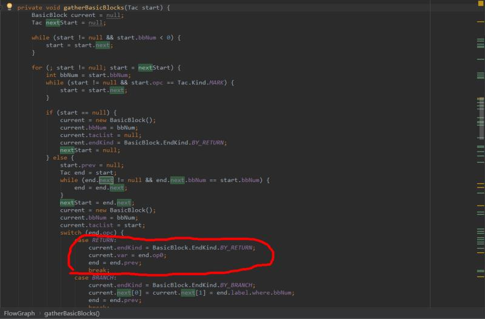
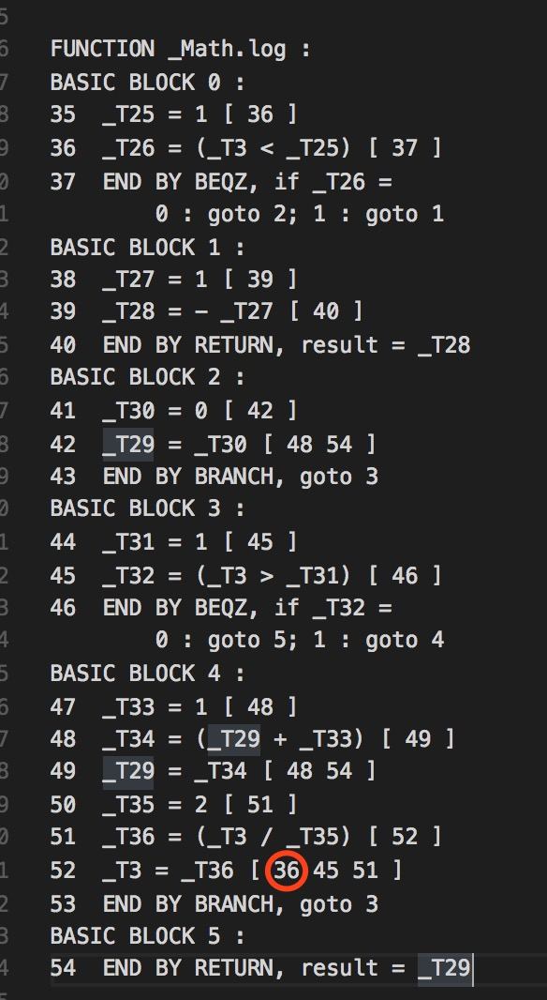
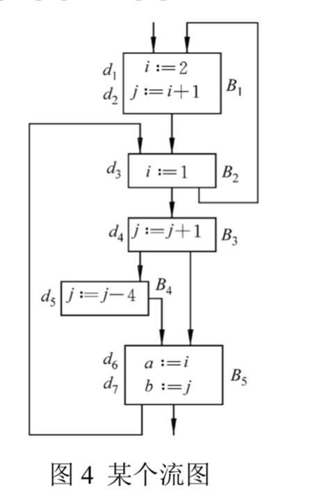

# 编译原理PA4实验报告

###### 张钰晖 计55 2015011372 yuhui-zh15@mails.tsinghua.edu.cn

# <重要说明>

由于本次实验没有采用Lecture 12的方法进行，故math.du与标准输出不一致。

根据同学的反映，框架中遇到return语句的时候这个框架并没有给next赋值，导致next的值为0，它会错误地认为下一个block是0。



这会导致math.du的第81行错误，不应该有36。



##### 由于笔者的算法依赖这部分框架程度较低，不需要框架此部分代码，故输出正确，没有输出36，导致和错误的答案输出不一致，特此说明，希望您理解加上此部分分数，谢谢！

### 任务描述

PA1阶段，我们完成了**词法分析**、**语法分析**，生成了**抽象语法树(AST)**。

PA2阶段，我们要基于PA1的抽象语法树，实现**构造符号表**、**静态语义检查**。

PA3阶段，我们在PA2的基础上，实现**语法制导的中间代码翻译**。	

PA4阶段，我们在PA3的基础上，进行数据流分析，实现**DU链求解**。

### 文件说明

在本阶段，以下文件非常重要，主要需要修改以下文件。

| 文件名                 | 含义     | 说明        |
| ------------------- | ------ | --------- |
| dataflow/BasicBlock | 基本块定义  | 实现DU链求解功能 |
| dataflow/FlowGraph  | 控制流图定义 | 实现DU链求解功能 |

### 实验说明

DU链即定值—引用链(Definition-Use Chaining)。

假设在程序中某点 p 定义了变量 A 的值，从 p 存在一条到达 A 的某个引用点 s 的路径，且该路径上不存在 A 的其他定值点，则把所有此类引用点 s 的全体称为 A 在定值点 p 的定值-引用链，简称 DU 链。

DU链反映了定义变量被使用情况，是数据流分析环节的重要一环。	

### 实验算法

本次实验没有采用Lecture 12的方法进行，故在此详细说明本算法。如果不能较好的理解这个算法，可以参考下面详细的Java代码。

对每个块的每个定义Tac语句，递归搜索定义变量被使用情况，直至遇到其被重复定义的Tac语句，这一段区间内使用的该变量的Tac语句即为DU链。

> 分析DU链伪代码如下

```
def 分析DU链：
    for 基本块 in 流图：
        for Tac语句 in 块Tac语句：
            if Tac语句 为定义类型：
                获得 Tac语句 定义的变量，清空搜索状态，递归跟踪该变量使用情况
```

在递归的过程中，若基本块已经被搜索或者该变量被重复定义，则递归返回。在递归的过程中，需要根据块结束类型，获得其连接的所有块，进行不同形式的递归。同时递归的过程中需要对递归深度为0进行特殊处理，因为递归深度为0时，需要对当前定义语句的下一条语句开始搜索，而其他时刻都从块第一条语句开始搜索。

> 递归搜索伪代码如下

```
def 递归搜索：
	if 基本块 已被搜索，返回
	if 递归深度 为0，起始搜索位置为定义语句下一条语句
	else 起始搜索位置为 基本块 第一条语句，标记块已搜索
	for Tac语句 in 块Tac语句：
		if Tac语句 使用了定义变量，记录该 Tac语句 位置
		if Tac语句 重新定义了之前变量，标记重定义，退出循环
	if 没有重定义：
		根据返回类型，查看 基本块 返回语句是否使用了定义变量，递归搜索 基本块 所有的连接块
	返回
```

获得Tac语句定义变量和判断Tac语句是否使用了定义变量较为简单，不再赘述，可以参考代码。

由于标记了每个块是否被搜索，每个块至多被搜索一次，故单条语句搜索算法复杂度为O(n)，不会出现指数型递归的情况。总体算法复杂度上界为O(Tac语句数量平方)，事实上，由于并非所有Tac语句都为定义语句，同时由于每个块能递归的连接块远远小于程序总块数（因为一条Tac语句的递归区间一般仅在一个函数中），故实际算法复杂度应该低得多。

### 实验实现

本次实验没有按照Lecture 12的方法进行，故在此列出详细的Java代码。

由于框架已经提供好了很多方便的接口，例如Tac的id，BasicBlock的id等，故本次实验修改较为简单，主要是使用接口。

- 修改类dataflow/BasicBlock.java

修改DUChain为public变量，新增searched变量用于记录基本块是否已经被搜索。

```java
public Map<Pair, Set<Integer>> DUChain;
public boolean searched;
```

- 修改类dataflow/FlowGraph.java

新增DU链分析函数analyzeDuChain，新增递归搜索DU链函数dfsSearch，新增获取定义函数getDef，新增判断TAC语句是否使用定义的变量isUse。

```java
public FlowGraph(Functy func) {
	...
    analyzeDuChain();
}

public void analyzeDuChain(){
    for (BasicBlock bb : bbs) {
        Tac taclist = bb.tacList;
        for (Tac t = taclist; t != null; t = t.next){
            Temp def = getDef(t);
            if (def == null) continue;
            Pair pair = new Pair(t.id, t.op0);
            Set<Integer> locations = new TreeSet<Integer>();
            for (BasicBlock blk : bbs) blk.searched = false;
            dfsSearch(locations, t, bb, 0);
            bb.DUChain.put(pair, locations);
        }
    }
}

private void dfsSearch(Set<Integer> locations, Tac tac, BasicBlock bb, int depth) {
    if (bb.searched) return;
    Tac taclist;
    if (depth == 0) { taclist = tac.next; }
    else { taclist = bb.tacList; bb.searched = true; }
    Temp def = getDef(tac);
    boolean isRedef = false;
    for (Tac t = taclist; t != null; t = t.next) {
        if (isUse(def, t)) {
            locations.add(t.id);
        }
        Temp redef = getDef(t);
        if (def == redef) {
            isRedef = true;
            break;
        }
    }
    if (!isRedef) {
        switch (bb.endKind) {
            case BY_BRANCH:
                dfsSearch(locations, tac, getBlock(bb.next[0]), depth + 1);                              
                break;
            case BY_BEQZ:                       
            case BY_BNEZ:
                if (bb.var == def) {
                    locations.add(bb.endId);
                }
                dfsSearch(locations, tac, getBlock(bb.next[0]), depth + 1);
                dfsSearch(locations, tac, getBlock(bb.next[1]), depth + 1);
                break;
            case BY_RETURN: 
                if (bb.var == def) {
                    locations.add(bb.endId);
                }
                break;
        }
    }  
}

public boolean isUse (Temp def, Tac tac) {
    switch (tac.opc) {
        case ADD:
        case SUB:
        case MUL:
        case DIV:
        case MOD:
        case LAND:
        case LOR:
        case GTR:
        case GEQ:
        case EQU:
        case NEQ:
        case LEQ:
        case LES:
        /* use op1 and op2, def op0 */
            if (tac.op1 == def || tac.op2 == def) return true;
            break;
        case NEG:
        case LNOT:
        case ASSIGN:
        case INDIRECT_CALL:
        case LOAD:
        /* use op1, def op0 */
            if (tac.op1 == def) return true;
            break;
        case LOAD_VTBL:
        case DIRECT_CALL:
        case RETURN:
        case LOAD_STR_CONST:
        case LOAD_IMM4:
        /* def op0 */           
            break;
        case STORE:
        /* use op0 and op1*/
            if (tac.op0 == def || tac.op1 == def) return true;
            break;
        case BEQZ:
        case BNEZ:
        case PARM:
        /* use op0 */
            if (tac.op0 == def) return true;
            break;
        default:
        /* BRANCH MEMO MARK PARM*/
            break;
    }
    return false;
}

public Temp getDef (Tac tac) {
    Temp def = null;
    switch (tac.opc) {
        case ADD:
        case SUB:
        case MUL:
        case DIV:
        case MOD:
        case LAND:
        case LOR:
        case GTR:
        case GEQ:
        case EQU:
        case NEQ:
        case LEQ:
        case LES:
        /* use op1 and op2, def op0 */          
        case NEG:
        case LNOT:
        case ASSIGN:
        case INDIRECT_CALL:
        case LOAD:
        /* use op1, def op0 */          
        case LOAD_VTBL:
        case DIRECT_CALL:
        case RETURN:
        case LOAD_STR_CONST:
        case LOAD_IMM4:
        /* def op0 */
            def = tac.op0;
            break;  
        case STORE:
        /* use op0 and op1*/
        case BEQZ:
        case BNEZ:
        case PARM:
        /* use op0 */
            break;
        default:
        /* BRANCH MEMO MARK PARM*/
            break;
    }
    return def;
}
```

### 思考题

#### 1. 说明本阶段的工作，尤其是如何在现有框架下实现DU链的求解。

解答：前面已经充分通过了文字+伪代码+Java代码描述，如果您依旧没有理解，可以邮件或微信联系我。

#### 2. 以 TestCases/S4/t0.decaf(对应于讲义第 12 讲 2.2 节图 4)为例，分析输出的 TAC 序列与 DU 链信息，并验证它与讲义中 2.4.2 节给出的结果是一致的。

##### t0.decaf：

```java
class Main {
    static void main() {
        f();
    }

    static void f() {
        int i;
        int j;
        int a;
        int b;
        a = 0;
        b = 1;

        bool flag;
        flag = false;

        i = 2;
        j = i + 1;
        
        while (flag) {
            i = 1;
            if (flag)
                f();

            j = j + 1;
            if (flag)
                j = j - 4;
            a = i;
            b = j;
        }
    }
}
```

##### t0.du：

```matlab
FUNCTION _Main_New : 
BASIC BLOCK 0 : 
1	_T0 = 4 [ 2 ]
2	parm _T0
3	_T1 =  call _Alloc [ 5 6 ]
4	_T2 = VTBL <_Main> [ 5 ]
5	*(_T1 + 0) = _T2
6	END BY RETURN, result = _T1

FUNCTION main : 
BASIC BLOCK 0 : 
7	call _Main.f
8	END BY RETURN, void result

FUNCTION _Main.f : 
BASIC BLOCK 0 : 
9	_T7 = 0 [ 10 ]
10	_T5 = _T7 [ ]
11	_T8 = 1 [ 12 ]
12	_T6 = _T8 [ ]
13	_T10 = 0 [ 14 ]
14	_T9 = _T10 [ 21 24 30 ]
15	_T11 = 2 [ 16 ]
16	_T3 = _T11 [ 18 ]
17	_T12 = 1 [ 18 ]
18	_T13 = (_T3 + _T12) [ 19 ]
19	_T4 = _T13 [ 28 ]
20	END BY BRANCH, goto 1
BASIC BLOCK 1 : 
21	END BY BEQZ, if _T9 = 
	    0 : goto 7; 1 : goto 2
BASIC BLOCK 2 : 
22	_T14 = 1 [ 23 ]
23	_T3 = _T14 [ 35 ]
24	END BY BEQZ, if _T9 = 
	    0 : goto 4; 1 : goto 3
BASIC BLOCK 3 : 
25	call _Main.f
26	END BY BRANCH, goto 4
BASIC BLOCK 4 : 
27	_T15 = 1 [ 28 ]
28	_T16 = (_T4 + _T15) [ 29 ]
29	_T4 = _T16 [ 28 32 36 ]
30	END BY BEQZ, if _T9 = 
	    0 : goto 6; 1 : goto 5
BASIC BLOCK 5 : 
31	_T17 = 4 [ 32 ]
32	_T18 = (_T4 - _T17) [ 33 ]
33	_T4 = _T18 [ 28 36 ]
34	END BY BRANCH, goto 6
BASIC BLOCK 6 : 
35	_T5 = _T3 [ ]
36	_T6 = _T4 [ ]
37	END BY BRANCH, goto 1
BASIC BLOCK 7 : 
38	END BY RETURN, void result
```

##### 讲义图：



##### 讲义结果：

```
i 在定值点 d1 的 DU 链为 {d2}，
j 在定值点 d2 的 DU 链为 {d4}，
i 在定值点 d3 的 DU 链为 {d6}，
j 在定值点 d4 的 DU 链为 {d4,d5,d7}，
j 在定值点 d5 的 DU 链为 {d4,d7}
```

##### 分析验证：

由输出结果可以很容易找到Main.main和Main.f，Main.f后半部分与讲义一致，可以看出Main.f被分成了8个基本块，同时可以看出T3是i，T4是j，T7是a，T8是b。

由以下验证结果可知其与讲义中 2.4.2 节给出的结果是一致的。

```matlab
以下可验证 i 在定值点 d1 的 DU 链为 {d2}
16	_T3 = _T11 [ 18 ] **
17	_T12 = 1 [ 18 ]
18	_T13 = (_T3 + _T12) [ 19 ]
以下可验证 j 在定值点 d2 的 DU 链为 {d4}
18	_T13 = (_T3 + _T12) [ 19 ]
19	_T4 = _T13 [ 28 ] **
27	_T15 = 1 [ 28 ]
28	_T16 = (_T4 + _T15) [ 29 ]
以下可验证 i 在定值点 d3 的 DU 链为 {d6}
22	_T14 = 1 [ 23 ]
23	_T3 = _T14 [ 35 ] **
35	_T5 = _T3 [ ]
以下可验证 j 在定值点 d4 的 DU 链为 {d4,d5,d7}
27	_T15 = 1 [ 28 ]
28	_T16 = (_T4 + _T15) [ 29 ]
29	_T4 = _T16 [ 28 32 36 ] **
31	_T17 = 4 [ 32 ]
32	_T18 = (_T4 - _T17) [ 33 ]
36	_T6 = _T4 [ ]
以下可验证 j 在定值点 d5 的 DU 链为 {d4,d7}
32	_T18 = (_T4 - _T17) [ 33 ]
33	_T4 = _T18 [ 28 36 ] **
27	_T15 = 1 [ 28 ]
28	_T16 = (_T4 + _T15) [ 29 ]
36	_T6 = _T4 [ ]
```

### 技巧心得

本次作业难度相对PA3有所缓和，通过以下方法可以加速编程。

#### 1. 仔细阅读代码框架

由于框架已经提供好了很多方便的接口，例如Tac的id，BasicBlock的id等，故本次实验修改较为简单，主要是使用接口。如果不理解这些接口自己实现的话，将花掉大量时间，代码量也急剧扩大。

#### 2. 仔细阅读测试样例及正确输出

当充分理解测试样例和正确输出后，不仅能加深巩固对DU链的理解，更是加速编程，调出bug的必要保证。

### 总结

本次实验PA4相对实验PA3难度略有下降，主要可能是因为框架已经提供好了很多方便的接口，并且一个明显的特点就是这次实现代码量并不算很大，或许是因为笔者的算法和课件略有不同。但实现时但必须非常充分理解整个框架的结构。在实现PA4过程中，通过以上两个技巧，加速了编程，在实现的过程中，充分的锻炼了笔者的编程能力，对DU链的相关概念理解有了质的提高，笔者在实践之中真正感受到了编译的神奇之处。
